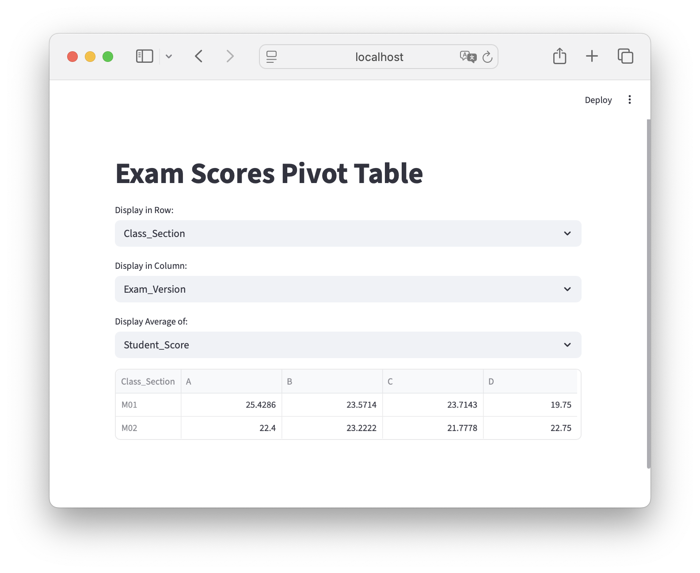

In this lesson you will learn how to group data together in a DataFrame and create summary statistics of the grouped data. You will also learn how to reshape a DataFrame, and create a pivot table.

For this lesson we will use the following data of (fake) exam scores:

```{python}
import pandas as pd
exams_data = 'https://raw.githubusercontent.com/mafudge/datasets/refs/heads/master/exam-scores/exam-scores.csv'
exams = pd.read_csv(exams_data)
exams.sample(10)
```

The `exam-scores.csv` file has been added to your class notebook repository, in `data-wrangling/data/delimited`.

## Group By

With large data sets we frequently want to group common data together and summarize those groups in some way.
For example, you might want to know:

- Average exam score by section
- Number of students who took each exam
- Average grade based on whether students studied in groups
- Total completion time by letter grade


The Pandas [groupby](https://pandas.pydata.org/docs/reference/api/pandas.DataFrame.groupby.html) method allows us to quickly group data like this. Using it involves two steps:

1. Run the `groupby` method on a dataframe, giving it a column or list of columns to group the data by.
2. The `groupby` method returns a `DataFrameGroupBy` object. On its own, this object isn't terribly informative. To get something useful, we use the aggregate method (`agg`) to summarize the grouped data and display it as a DataFrame. When aggregating the data, we need to provide the name of an operation (`sum, min, max, mean, std, quartile, count`) by which to summarizie the data.

Here's an example using our exams data:
```{python}
# Example: Total number of exams take by section and the average score in each section:
exams_by_section = exams.groupby(by=['Class_Section']).agg({ 'Class_Section': 'count', 'Student_Score': 'mean' })
exams_by_section
```

Here, we've chosen to group the exams by the class section. We've then produced a DataFrame in which the class sections are summarized by the number of students and their average score. The column names are a little confusing, however. Let's rename them to make the output more readable:

```{python}
exams_by_section = exams.groupby(by=['Class_Section']).agg({ 'Class_Section': 'count', 'Student_Score': 'mean' })
exams_by_section = exams_by_section.rename(columns={'Class_Section': 'Exam_Count', 'Student_Score': 'Average_Score'})
exams_by_section
```

Note that the grouped columns end up in the index. We can use the [index](https://pandas.pydata.org/docs/reference/api/pandas.DataFrame.index.html) method to add the grouped columns back as a column:

```{python}
exams_by_section['Class_Section'] = exams_by_section.index
exams_by_section
```

:::: {.callout-caution appearance="simple" icon="false"}
### Code Challenge 4.6.1

Create a Streamlit app that will load the exams csv file above and will allow the user to select one of the following: `Made_Own_Study_Guide`, `Did_Exam_Prep Assignment`, `Studied_In_Groups`. After the selection is made, display a dataframe that summarizes the count of students and the average student score for the selection.

*Hint*: For offering the selection, use Streamlit's [selectbox](https://docs.streamlit.io/develop/api-reference/widgets/st.selectbox) method.

::: {.callout-caution collapse="true" appearance="simple" icon="false"}
#### Solution

```{python}
#| eval: False
import streamlit as st
import pandas as pd

st.title("Exam Scores")


options = ['Made_Own_Study_Guide', 'Did_Exam_Prep Assignment', 'Studied_In_Groups']

exams = pd.read_csv('https://raw.githubusercontent.com/mafudge/datasets/refs/heads/master/exam-scores/exam-scores.csv')

option = st.selectbox('Select Exam:', options)

summary_df = exams.groupby(by=option).agg({'Class_Section': 'count', 'Student_Score' :'mean'})
summary_df = summary_df.rename(columns={'Class_Section': 'Student Count', 'Student_Score': 'Mean Score'})

st.dataframe(summary_df)
```

:::
::::


## Pivot and Melt

Pivot and melt are inverse operations:

- [pivot](https://pandas.pydata.org/docs/reference/api/pandas.DataFrame.pivot.html) makes "long" data "wide" moving rows into columns.
- [melt](https://pandas.pydata.org/docs/reference/api/pandas.melt.html#pandas.melt]`df.melt) makes "wide" data "long" moving columns into rows. Basically, the opposite of `pivot`.


::: {.callout-note}
- These functions only move data, they are unable to summarize it.

- The intersection of row/column must contain a single value. Multiple values under the same row/column will fail.
:::

To set this up this example from `exams` let's create a dataframe that summarizes the data. We will add the index columns back to the dataframe for clarity. Please note this is not something that needs to be done typically. We are just re-using the dataset for this example. (In fact, the following block of code is basically creating a *pivot table* from the exams data. We'll see how to create pivot tables using a much simpler way below.)

```{python}

# Get average scores by section and exam version:
avg_scores_by_section_and_version = exams.groupby(
    by=['Class_Section', 'Exam_Version']).agg({'Student_Score': 'mean'})

# add section and exam version back to dataframe
avg_scores_by_section_and_version['Class_Section'] = avg_scores_by_section_and_version.index.get_level_values('Class_Section')
avg_scores_by_section_and_version['Exam_Version'] = avg_scores_by_section_and_version.index.get_level_values('Exam_Version')
# reset the index
avg_scores_by_section_and_version = avg_scores_by_section_and_version.reset_index(drop=True)
#rename the Student_score to average score
avg_scores_by_section_and_version =  avg_scores_by_section_and_version.rename(columns={'Student_Score': 'Average_Score'})
#reorder the columns
avg_scores_by_section_and_version = avg_scores_by_section_and_version[['Class_Section', 'Exam_Version', 'Average_Score']]

#show
avg_scores_by_section_and_version
```

### Pivot()

Let's pivot this data two different ways:

- `exam_version_in_col`  - a pivot where the exam version is in the column
- `class_section_in_col` - a pivot where the class section is in the column

```{python}
exam_version_in_col = avg_scores_by_section_and_version.pivot(
    index='Class_Section', columns='Exam_Version', values='Average_Score')
exam_version_in_col
```

```{python}
class_section_in_col = avg_scores_by_section_and_version.pivot(
    index='Exam_Version', columns='Class_Section', values='Average_Score')
class_section_in_col
```

### Melt()

We will now melt the data back into its original shape. Melt requires:

- `id_vars=list` list of columns which remain in the melt
- `var_name=str` column name of the columns to unpivot 
- `value_name` column name of the values to unpivot

First, to get this this example to work, we need to add the index values as a column (here called `Class_Section`):

```{python}
exam_version_in_col['Class_Section'] = exam_version_in_col.index
melted1 = exam_version_in_col.melt(id_vars=["Class_Section"],
                                   var_name="Exam_Version",
                                   value_name='Average_Score')
melted1
```

Doing the same with the `class_section_in_col`:
```{python}
class_section_in_col['Exam_Version'] = class_section_in_col.index
melted2 = class_section_in_col.melt(id_vars=["Exam_Version"],
                                    var_name="Class_Section",
                                    value_name='Average_Score')
melted2
```

## Pivot_table()

The `pd.pivot_table()` function combines a `groupby()` with a `pivot()`. Its intended for when you need to pivot and aggregate in the pivot, avoiding a lot of extra code such as adding indexes as columns (as we had to above).

Here's the examples above, but with a pivot_table on the original `exams`data. We can skip the processing building `avg_scores_by_section_and_version` because `pivot_table()` allows us to summarize data.

```{python}
exam_version_in_col = exams.pivot_table(index='Class_Section',
                                        columns='Exam_Version',
                                        values='Student_Score',
                                        aggfunc='mean')
exam_version_in_col
```

```{python}
class_section_in_col = exams.pivot_table(index='Exam_Version',
                                         columns='Class_Section',
                                         values='Student_Score',
                                         aggfunc='mean')
class_section_in_col
```

:::: {.callout-caution appearance="simple" icon="false"}
### Code Challenge 4.6.2

Let's build an interactive pivot table in streamlit! Using the exams csv file from above:

1. Add a selection widget (use Steamlit's [selectbox](https://docs.streamlit.io/develop/api-reference/widgets/st.selectbox) method) that lets the user select one of the following fields to put in the row of the pivot table:

    ```{python}
    #| eval: false
    fields = ['Class_Section', 'Exam_Version', 'Made_Own_Study_Guide', 'Did_Exam_Prep Assignment', 'Studied_In_Groups','Letter_Grade']
    ```

1.  Add another selection widget that allows the user to select which field to display in the columns. *Note:* you will need to remove the field the user selected for the row in the list of options, else you'll get an error if they select the same field twice.

1.  Create another selection widget that allows the user to select what data to populate the pivot table with. The pivot table should display the average of the selected value. The options for the displayed data should be:

    ```{python}
    #| eval: false
    measures = ['Completion_Time','Student_Score']
    ```

1.  Build the pivot table dataframe from the inputs. Use the average for the `aggfunc`

1.  Display the pivot table.

Here's a screen shot of what your app should like:



**Bonus:** Cache the exams data so that it is not reloaded every time you interact with the app! Refer back to the [Session State section of the Streamlit tutorial](https://su-ist356-m003-fall-2025.github.io/course-home/03_ui/ui-2.html#session-state-helping-streamlit-remember-values) for help.

::: {.callout-caution collapse="true" appearance="simple" icon="false"}
#### Solution

```{python}
#| eval: False
import streamlit as st
import pandas as pd

st.title("Exam Scores Pivot Table")

# load the data: we'll only do this once, then cache
if 'exams' not in st.session_state:
    st.session_state.exams = pd.read_csv('https://raw.githubusercontent.com/mafudge/datasets/refs/heads/master/exam-scores/exam-scores.csv')

# set up the options
fields = [ 'Class_Section', 'Exam_Version', 'Made_Own_Study_Guide', 'Did_Exam_Prep Assignment', 'Studied_In_Groups','Letter_Grade']
measures = ['Student_Score', 'Completion_Time']
row = st.selectbox('Display in Row:', fields)
fields.remove(row)
col = st.selectbox('Display in Column:', fields)
value = st.selectbox('Display Average of:', measures)

pivot_df = st.session_state.exams.pivot_table(index=row, columns=col, values=value, aggfunc='mean')
st.dataframe(pivot_df)
```

:::
::::
